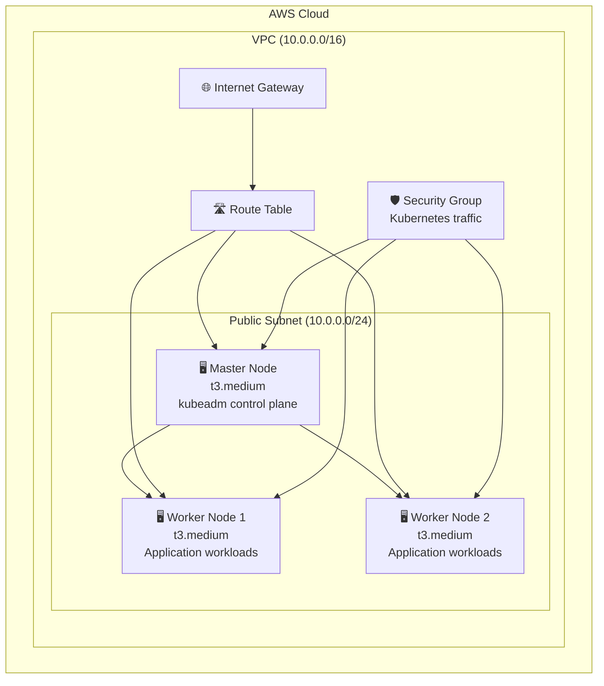

<div align="center">

# 🚀 Kubernetes Infrastructure on AWS

### **Production-Ready Kubernetes Cluster with Terraform**

[](https://www.terraform.io/)
[](https://aws.amazon.com/)
[](https://kubernetes.io/)
[](https://ubuntu.com/)

*A comprehensive Infrastructure as Code solution for deploying scalable Kubernetes clusters on AWS using kubeadm*

[📖 Documentation](#-documentation) • [🚀 Quick Start](#-quick-start) • [🏗️ Architecture](#️-architecture) • [🔧 Features](#-features) • [📋 Prerequisites](#-prerequisites) • [⚙️ Configuration](#️-configuration) • [🔐 Security](#-security) • [🐛 Troubleshooting](#-troubleshooting)

---

</div>

## 🎯 Project Overview

This Terraform project automates the deployment of a **production-ready Kubernetes cluster** on AWS infrastructure. It includes a master node and multiple worker nodes with automated Kubernetes installation, proper networking, security groups, and monitoring capabilities.

### ✨ Key Highlights

- 🔥 **Zero-touch deployment** - Fully automated Kubernetes installation
- 🛡️ **Security-first approach** - Proper security groups and IAM configurations
- 📈 **Scalable architecture** - Easy to add more worker nodes
- 🔄 **Infrastructure as Code** - Version controlled and reproducible deployments
- 🌐 **Multi-AZ ready** - Can be extended for high availability
- 📊 **Monitoring ready** - Pre-configured for observability

---

## 🏗️ Architecture

<div align="center">



</div>

### 🏢 Infrastructure Components

| Component | Type | Purpose | Specifications |
|-----------|------|---------|----------------|
| **VPC** | Network | Isolated network environment | CIDR: `10.0.0.0/16` |
| **Public Subnet** | Network | Internet-accessible resources | CIDR: `10.0.0.0/24` |
| **Internet Gateway** | Network | Internet connectivity | Auto-attached to VPC |
| **Route Table** | Network | Traffic routing rules | Routes to Internet Gateway |
| **Security Group** | Security | Traffic filtering | Kubernetes-optimized rules |
| **Master Node** | Compute | Control plane | t3.medium, Ubuntu 22.04 |
| **Worker Nodes** | Compute | Application workloads | t3.medium, Ubuntu 22.04 |

---

## 🚀 Quick Start

### ⚡ One-Command Deployment

```bash
# Clone and deploy in one go
git clone <repository-url> && cd k8s && \
cp terraform.tfvars.example terraform.tfvars && \
# Edit terraform.tfvars with your credentials, then:
terraform init && terraform apply -auto-approve
```

### 🎯 Complete Infrastructure Automation

<div align="center">

**This project provides complete automation from zero to fully functional Kubernetes cluster:**

</div>

| Phase | Terraform Command | What It Does | Duration |
|-------|------------------|--------------|----------|
| **🏗️ Infrastructure** | `terraform apply` | Creates VPC, subnets, EC2 instances, security groups | 10-15 min |
| **🐳 Kubernetes Setup** | `terraform apply` | Installs Kubernetes via user_data scripts | 20-30 min |
| **🧹 Cleanup** | `terraform destroy` | Removes ALL infrastructure completely | 5-10 min |

**✅ Everything is managed by Terraform - no manual steps required!**

### 📋 Step-by-Step Guide

<details>
<summary><b>🔧 1. Prerequisites Setup</b></summary>

```bash
# Install Terraform
curl -fsSL https://apt.releases.hashicorp.com/gpg | sudo apt-key add -
sudo apt-add-repository "deb [arch=amd64] https://apt.releases.hashicorp.com $(lsb_release -cs)"
sudo apt-get update && sudo apt-get install terraform

# Install AWS CLI
curl "https://awscli.amazonaws.com/awscli-exe-linux-x86_64.zip" -o "awscliv2.zip"
unzip awscliv2.zip && sudo ./aws/install

# Verify installations
terraform version && aws --version
```

</details>

<details>
<summary><b>🔐 2. AWS Configuration</b></summary>

```bash
# Option A: Environment Variables (Recommended)
export AWS_ACCESS_KEY_ID="your-access-key"
export AWS_SECRET_ACCESS_KEY="your-secret-key"
export AWS_DEFAULT_REGION="eu-central-1"

# Option B: AWS CLI Configuration
aws configure

# Option C: Terraform Variables File
cp terraform.tfvars.example terraform.tfvars
# Edit terraform.tfvars with your credentials
```

</details>

<details>
<summary><b>🚀 3. Deploy Infrastructure</b></summary>

```bash
# Initialize Terraform
terraform init

# Validate configuration
terraform validate

# Preview changes
terraform plan

# Deploy infrastructure
terraform apply -auto-approve

# Get output information
terraform output
```

</details>

<details>
<summary><b>🐳 4. Initialize Kubernetes</b></summary>

```bash
# SSH to master node
MASTER_IP=$(terraform output -raw public-ip-master-01)
ssh -i your-key.pem ubuntu@$MASTER_IP

# Initialize cluster
sudo kubeadm init --pod-network-cidr=10.244.0.0/16

# Configure kubectl
mkdir -p $HOME/.kube
sudo cp -i /etc/kubernetes/admin.conf $HOME/.kube/config
sudo chown $(id -u):$(id -g) $HOME/.kube/config

# Install CNI
kubectl apply -f https://raw.githubusercontent.com/flannel-io/flannel/master/Documentation/kube-flannel.yml
```

</details>

---

## 🔧 Features

### 🎯 Core Features

<div align="center">

| Feature | Description | Status |
|---------|-------------|--------|
| 🔥 **Automated Setup** | Zero-touch Kubernetes installation | ✅ Ready |
| 🛡️ **Security Groups** | Production-ready network security | ✅ Ready |
| 📊 **Monitoring Ready** | Pre-configured for observability | ✅ Ready |
| 🔄 **Auto Scaling** | Easy worker node addition | ✅ Ready |
| 🌐 **Multi-AZ Support** | High availability ready | ✅ Ready |
| 📝 **IaC Best Practices** | Version controlled infrastructure | ✅ Ready |

</div>

### 🚀 Advanced Capabilities

- **🔧 Automated Kubernetes Installation**: Pre-configured user data scripts for kubeadm
- **🛡️ Production Security**: Proper security groups and networking configuration
- **📈 Scalable Architecture**: Easy to add more worker nodes
- **🔄 Infrastructure as Code**: Fully managed with Terraform
- **🌐 Multi-AZ Ready**: Can be extended for high availability
- **📊 Monitoring Integration**: Ready for Prometheus, Grafana, and other tools
- **⚡ Complete Automation**: Everything from infrastructure to Kubernetes setup

---

## 📋 Prerequisites

### 🛠️ Required Tools

<div align="center">

| Tool | Version | Installation |
|------|---------|--------------|
| **Terraform** | `>= 1.0` | [Download](https://www.terraform.io/downloads.html) |
| **AWS CLI** | `>= 2.0` | [Install Guide](https://aws.amazon.com/cli/) |
| **kubectl** | `>= 1.25` | [Install Guide](https://kubernetes.io/docs/tasks/tools/) |

</div>

### ☁️ AWS Requirements

- **AWS Account** with appropriate permissions
- **AWS Key Pair** for SSH access
- **IAM User** with EC2, VPC, and IAM permissions
- **Sufficient Quotas** for the selected instance types

### 💻 System Requirements

- **Operating System**: Linux, macOS, or Windows with WSL
- **Memory**: Minimum 4GB RAM for Terraform operations
- **Storage**: 1GB free space for Terraform files
- **Network**: Internet connection for provider downloads

---

## ⚙️ Configuration

### 🔧 Variables Overview

<div align="center">

| Category | Variables | Description |
|----------|-----------|-------------|
| **🔐 AWS** | `aws_region`, `aws_access_key`, `aws_secret_key` | AWS provider configuration |
| **🌐 Network** | `vpc_cidr`, `pub_subnet_cidr` | Network addressing |
| **🖥️ Compute** | `instance_type`, `ami_id` | Instance specifications |
| **💾 Storage** | `volume_size`, `volume_type` | Storage configuration |
| **🔑 Security** | `key_pair_name`, `allowed_ssh_ips`, `allowed_api_ips` | SSH key and security group configuration |

</div>

### 📝 Configuration Examples

<details>
<summary><b>🔐 Basic Configuration</b></summary>

```hcl
# terraform.tfvars
aws_region     = "eu-central-1"
aws_access_key = "your-access-key"
aws_secret_key = "your-secret-key"

instance_type = "t3.medium"
key_pair_name = "your-key-pair"
```

</details>

<details>
<summary><b>🌐 Network Configuration</b></summary>

```hcl
# Custom network setup
vpc_cidr        = "172.16.0.0/16"
pub_subnet_cidr = "172.16.1.0/24"
```

</details>

<details>
<summary><b>🖥️ Production Configuration</b></summary>

```hcl
# Production-ready setup
instance_type = "t3.large"
volume_size   = 50
volume_type   = "gp3"

# Security configuration for production
allowed_ssh_ips = [
  "YOUR_OFFICE_IP/32",
  "YOUR_HOME_IP/32",
  "YOUR_VPN_IP/32"
]

allowed_api_ips = [
  "YOUR_ADMIN_IP/32"
]

environment = "production"
```

</details>

---

## 🔐 Security

### 🛡️ Security Group Configuration

<div align="center">

**Flexible and secure security group configuration with minimal required access:**

</div>

#### 🔧 Configurable Access Rules

| Port | Protocol | Purpose | Default Access | Production Recommendation |
|------|----------|---------|----------------|---------------------------|
| **22** | TCP | SSH Administration | `0.0.0.0/0` | Specific IPs only |
| **6443** | TCP | Kubernetes API | `0.0.0.0/0` | Admin IPs only |
| **2379-2380** | TCP | etcd Communication | Self only | Self only |
| **10250** | TCP | Kubelet API | Self only | Self only |
| **10256** | TCP | Kube-proxy Health | Self only | Self only |
| **30000-32767** | TCP/UDP | NodePort Services | `0.0.0.0/0` | Restrict if not needed |
| **ICMP** | ICMP | Network Troubleshooting | `0.0.0.0/0` | Restrict in production |

#### 🎯 Security Variables

```hcl
# Development (less secure, easier access)
allowed_ssh_ips = ["0.0.0.0/0"]
allowed_api_ips = ["0.0.0.0/0"]

# Production (secure, restricted access)
allowed_ssh_ips = ["YOUR_IP/32", "OFFICE_IP/32"]
allowed_api_ips = ["ADMIN_IP/32"]
```

### 🛡️ Security Features

<div align="center">

| Security Layer | Implementation | Status |
|----------------|----------------|--------|
| **🔐 Credential Management** | Environment variables / terraform.tfvars | ✅ Secure |
| **🛡️ Network Security** | Security groups with proper rules | ✅ Configured |
| **🔑 SSH Access** | Key-based authentication | ✅ Enabled |
| **🌐 VPC Isolation** | Private network environment | ✅ Implemented |
| **📊 Audit Logging** | CloudTrail ready | ⚠️ Manual Setup |

</div>

### 🔒 Security Best Practices

#### ✅ Implemented
- **Credential Security**: No hardcoded secrets in code
- **Network Isolation**: VPC with controlled access
- **SSH Security**: Key-based authentication only
- **Resource Tagging**: Proper resource identification
- **Configurable Security Groups**: Minimal required access with variable-based configuration

#### ⚠️ Production Recommendations
- **Restrict Security Groups**: Limit access to specific IPs using `allowed_ssh_ips` and `allowed_api_ips`
- **Use Private Subnets**: For worker nodes
- **Enable CloudTrail**: For audit logging
- **Implement IAM Roles**: Instead of access keys
- **Enable VPC Flow Logs**: For network monitoring
- **Review Security Groups**: Ensure only required ports are open

---

## 🐛 Troubleshooting

### 🔍 Common Issues

<details>
<summary><b>❌ Terraform Errors</b></summary>

```bash
# Issue: Provider not found
Error: Failed to query available provider packages

# Solution:
terraform init -upgrade

# Issue: Invalid credentials
Error: error configuring Terraform AWS Provider

# Solution:
aws configure
# or set environment variables
```

</details>

<details>
<summary><b>❌ Kubernetes Issues</b></summary>

```bash
# Issue: Node not ready
kubectl describe node <node-name>

# Issue: Pods stuck in pending
kubectl describe pod <pod-name>

# Issue: Network connectivity
kubectl get pods -n kube-system
```

</details>

<details>
<summary><b>❌ AWS Issues</b></summary>

```bash
# Issue: Insufficient permissions
aws sts get-caller-identity

# Issue: Quota exceeded
aws service-quotas get-service-quota --service-code ec2 --quota-code L-1216C47A

# Issue: Key pair not found
aws ec2 describe-key-pairs --key-names your-key-pair
```

</details>

### 📊 Debug Commands

```bash
# Terraform debugging
terraform plan -detailed-exitcode
terraform validate

# Kubernetes debugging
kubectl get nodes -o wide
kubectl get pods --all-namespaces
kubectl describe node <node-name>

# AWS debugging
aws ec2 describe-instances --filters "Name=tag:Name,Values=master-01"
aws ec2 describe-security-groups --group-names k8s-sg
```

---

## 📚 Documentation

### 📖 Additional Resources

<div align="center">

| Resource | Description | Link |
|----------|-------------|------|
| **📋 Deployment Guide** | Step-by-step deployment instructions | [DEPLOYMENT.md](DEPLOYMENT.md) |
| **🔐 Security Guide** | Security best practices and guidelines | [SECURITY.md](SECURITY.md) |
| **🐳 Kubernetes Docs** | Official Kubernetes documentation | [kubernetes.io](https://kubernetes.io/docs/) |
| **🏗️ Terraform Docs** | Terraform AWS provider documentation | [registry.terraform.io](https://registry.terraform.io/providers/hashicorp/aws/latest/docs) |
| **☁️ AWS Docs** | AWS service documentation | [aws.amazon.com](https://aws.amazon.com/documentation/) |

</div>

### 🎓 Learning Resources

- **Kubernetes Tutorials**: [kubernetes.io/tutorials](https://kubernetes.io/docs/tutorials/)
- **Terraform Best Practices**: [terraform.io/docs](https://www.terraform.io/docs)
- **AWS Well-Architected**: [aws.amazon.com/architecture](https://aws.amazon.com/architecture/)

---

## 🤝 Contributing

We welcome contributions! Please see our contributing guidelines:

### 🚀 How to Contribute

1. **Fork the repository**
2. **Create a feature branch**: `git checkout -b feature/amazing-feature`
3. **Make your changes** and test thoroughly
4. **Commit your changes**: `git commit -m 'Add amazing feature'`
5. **Push to the branch**: `git push origin feature/amazing-feature`
6. **Open a Pull Request**

### 📝 Development Guidelines

- Follow Terraform best practices
- Add proper documentation for new features
- Include tests for new functionality
- Update README.md for significant changes

---

## 📄 License

<div align="center">

This project is licensed under the **MIT License** - see the [LICENSE](LICENSE) file for details.

[](https://opensource.org/licenses/MIT)

</div>

---

<div align="center">

</div> 